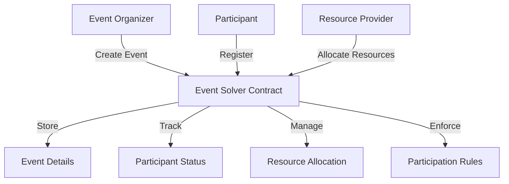

# Event Solver

A decentralized platform for solving complex event logistics and coordination using blockchain technology.

## Overview

Event Solver provides a trustless infrastructure for managing event planning, coordination, and resource allocation. It enables event organizers, participants, and stakeholders to:

- Create and manage complex event workflows
- Allocate and track event resources dynamically
- Implement transparent and fair participation mechanisms
- Enable secure, verifiable event registrations
- Handle sophisticated event coordination scenarios

## Architecture

The system is built around a central contract that manages event registration, resource allocation, and participant interactions.



### Core Components
- Event Registry: Manages event metadata and lifecycle
- Participant Management: Tracks registrations and roles
- Resource Allocation: Dynamically assigns and tracks resources
- Workflow Coordination: Implements complex event logic

## Contract Documentation

### Event Solver Contract

The main contract managing event coordination and logistics.

#### Key Features
- Flexible event registration mechanisms
- Dynamic resource allocation
- Participant role and permission management
- Transparent event workflow tracking
- Secure and verifiable interactions

#### Access Control
- Event creation and modification restricted to authorized parties
- Role-based participation rules
- Transparent and auditable event processes

## Getting Started

### Prerequisites
- Clarinet
- Stacks wallet
- STX tokens for transactions

### Basic Usage

1. **Create a new event**
```clarity
(contract-call? .event-solver create-event
    "Tech Conference 2024"
    "Annual technology and innovation summit"
    u100  ;; Maximum participants
    {start-time: u1735689600, end-time: u1735776000}
    true  ;; Is public registration
)
```

2. **Register for an event**
```clarity
(contract-call? .event-solver register-participant event-id participant-details)
```

3. **Allocate event resources**
```clarity
(contract-call? .event-solver allocate-resources event-id resource-type quantity)
```

## Function Reference

### Public Functions

#### Event Management
- `create-event`: Initialize a new event
- `update-event-details`: Modify event metadata
- `cancel-event`: Cancel an existing event

#### Participant Interactions
- `register-participant`: Join an event
- `update-participant-status`: Modify participant details
- `transfer-participation`: Transfer event registration

#### Resource Handling
- `allocate-resources`: Assign resources to an event
- `release-resources`: Free up unused resources
- `request-resource-allocation`: Propose resource usage

### Read-Only Functions
- `get-event-details`: Retrieve event information
- `check-participant-status`: Verify participant registration
- `get-resource-allocation`: View current resource status
- `validate-event-rules`: Check participation eligibility

## Development

### Testing
1. Clone the repository
2. Install Clarinet
3. Run tests:
```bash
clarinet test
```

### Local Development
1. Start Clarinet console:
```bash
clarinet console
```
2. Deploy contracts:
```clarity
(contract-call? .event-solver ...)
```

## Security Considerations

### Limitations
- Event participant limits
- Resource allocation constraints
- Registration period restrictions

### Best Practices
- Verify participant eligibility
- Implement multi-signature approvals for critical actions
- Use time-based locks for sensitive operations
- Continuously audit and validate event workflows